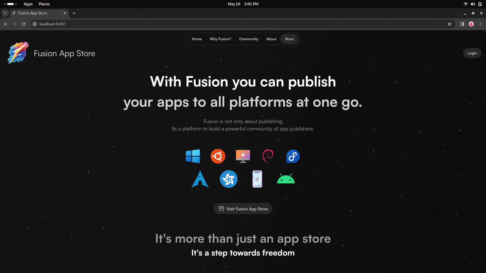

    

With Fusion you can publish your multiplatform desktop applications from a single app store.
Not just multiplatform apps, you can even publish your apps that works for a specific platform. 
Currently, Fusion supports all desktop platforms and Android apps.

###  Features
Written in Flutter with Firebase at the backend, 
Fusion provides a bunch of great unique features:

- No Registration Cost
- No Onboarding Cost
- No Commissions on your revenue
- Publisher Profile
- Follow/Unfollow Users
- Like Apps
- Instant App Uploads
- Live Updates throughtout the App Store
- Unique App Review System
- Full Featured Dashboard to customize your apps
- Google Sign In Support

### Origin

Started as a college project, Fusion is the true combination of desktop app stores to provide a central place for the developers to publish their applications whether open source or proprietary from a single app store to all the desktop platforms.

Fusion already has support for publishing Android Applications.

When you enter Fusion, you will find an already existing set of applications, these are sample apps loaded on the platform just to showcase how an app would appear on the platform, these apps are not **downloadable**.

You can publish your applications free of cost.
To sustain the platform, ads can be run and even we have an analytics dashboard which would be premium for any developer who would want to see their performance on the platform.

When I was starting with development, I saw the unfair practice of charging the developers just to put their applications on the different app stores, now, suppose if your app is cross-platform you have to publish it on different app stores and they will charge you separately on your yearly revenue, that's why and how I came up with the idea of Fusion.

There's lot more work to be done on the platform, like completing the analytics dashboard,
the project is currently hosted from Firebase' spark plan, so we got limited storage and resources until there's enogh contribution for the project to become the professional app store.

This project gives an starting point to anyone to understand how to build their own app store.

Thanks for trying out the Fusion App Store, if you haven't yet, then, please give it a try, it's amazing.

